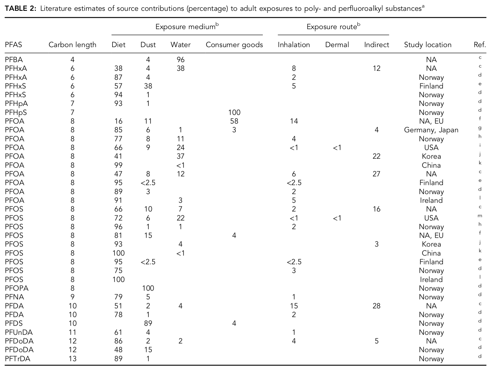
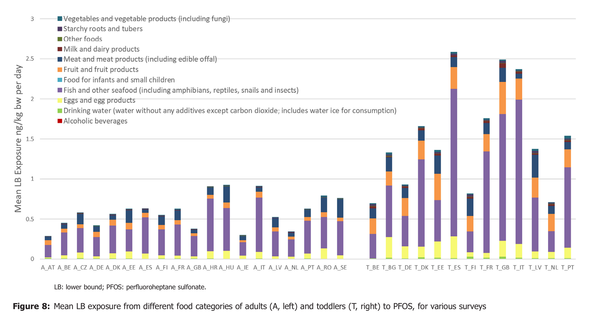

# Intro

This notebook goes into several issues with the RoTS, 2018 memo on deriving a norm for PFOS contamination in soil at the site of the Oosterweel works.

The overall logic to determine a soil PFOS norm is

* Determine a safe level of todal daily intake (TDI) of PFOS for humans
* Attribute the maximal amount of PFOS intake through drinking water given all other sources of PFOS intake (primarily food)
* Next, calculate a maximal concentration of PFOS in drinking water based on an assumed 2.2L drinking per day (WHO standard)
* To guarantee the use of groundwater for drinking purposes, equate the maximal PFOS concentration in groundwater to the drinking water norm
* Based on experiments and literature data: compute the maximal PFOS in soil to guarantee leaching concentration at or below the drinking water norm

# Health impacts of PFOS

The state of the art of scientific knowledge on the health impacts of PFOS and other PFAS is summarized in the abstract of the critical review from Fenton, et al., 2021 (image source: https://www.eea.europa.eu/publications/emerging-chemical-risks-in-europe/emerging-chemical-risks-in-europe):


> Reports of environmental and human health impacts of per‐and polyfluoroalkyl substances (PFAS) have greatlyincreased in the peer‐reviewed literature. The goals of the present review are to assess the state of the science regardingtoxicological effects of PFAS and to develop strategies for advancing knowledge on the health effects of this large family ofchemicals. Currently, much of the toxicity data available for PFAS are for a handful of chemicals, primarily legacy PFAS suchas perfluorooctanoic acid and perfluorooctane sulfonate. Epidemiological studies have revealed associations between ex-posure to specific PFAS and a variety of health effects, including altered immune and thyroid function, liver disease, lipid andinsulin dysregulation, kidney disease, adverse reproductive and developmental outcomes, and cancer. Concordance with experimental animal data exists for many of these effects. However, information on modes of action and adverse outcome pathways must be expanded, and profound differences in PFAS toxicokinetic properties must be considered in understanding differences in responses between the sexes and among species and life stages. With many health effects noted for a relatively few example compounds and hundreds of other PFAS in commerce lacking toxicity data, more contemporary and high‐throughput approaches such as read‐across, molecular dynamics, and protein modeling are proposed to accelerate thedevelopment of toxicity information on emerging and legacy PFAS, individually and as mixtures. In addition, an appropriate degree of precaution, given what is already known from the PFAS examples noted, may be needed to protect human health.
(Fenton, et al., 2021)


Figure source: https://www.eea.europa.eu/publications/emerging-chemical-risks-in-europe/emerging-chemical-risks-in-europe


# Todal daily intake (TDI) for PFOS

Based on increasingly abundant evidence of adverse health impacts of PFOS and other PFAS, several regulating bodies have been ever more restrictive in their advises. Below we list the todal daily intake (TDI) values put out over the last decade by the Environmental Protection Agency (EPA, US) and the European Food Security Agency (EFSA, EU). Note that the adverse effects of PFOS on the immune system is long known in mice, and has more recently been corroborated by cohort studies during vaccination programs. It is exactly based on the latter that the latest more stringent norm of EFSA is based.  


|source|year|TDI (PFOS)|unit        |
|------|----|----------|------------|
|EFSA  |2008|150       |ng/kg lg/dag|
|EPA   |2009|80        |ng/kg lg/dag|
|EPA   |2016|20        |ng/kg lg/dag|
|EFSA  |2018|20        |ng/kg lg/dag|
|EFSA  |2020|0.63      |ng/kg lg/dag|


# Attribution
As for most toxic contaminants, humans are exposed to PFAS via different pathways (food, water, dust, skin,...). De Silva et al. (2021) provide a critical review of the current knowledge on exposure pathways. In many cases, the exposure to or in take of chemical contaminants from drinking-water is much lower than that from other sources (WHO, 2011). Consequently, when deriving health norms for contaminants in certain products or media, one has to take the other exposure pathways into account. This is called attribution. The WHO has clear guidelines for how to determine attribution factors for contaminants in drinking water. 

## Abscence of exposure data

> In the absence of adequate exposure data, the normal allocation of the total daily intake to drinking-water is 20%, which reflects a reasonable level of exposure based on broad experience, while still being protective. [...] There is variation in both the volume of water consumed daily and the body weight of
consumers. It is therefore necessary to apply some assumptions in order to determine a guideline value. The default assumption for consumption by an adult is 2 litres of water per day, whereas the default assumption for body weight is 60 kg. In some cases, the guideline value is based on children, where they are considered to be particularly vulnerable to a particular substance. In this event, a default intake of 1 litre is assumed for a body weight of 10 kg; where the most vulnerable group is considered to be bottle-fed infants, an intake of 0.75 litre is assumed for a body weight of 5 kg.
(WHO, 2011, p163-p164)

This heuristics is the standard procedure to compute the concentration of contaminants in drinking water *in the abscense of exposure data*. Simply by multiplying the TDI with body-weight and *default attribution factor (20%)*, and dividing by a typical value of 2L per day for adults and 1L per day by children, we can expand the former table. Note that the final concentrations in drinking water are in nanogram per liter.


|source|year|TDI (PFOS)|unit        | drinking water, adult (60kg) | drinking water, child (10kg)|unit| 
|------|----|----------|------------|------------------------------|-----------------------------|----|
|EFSA  |2008|150       |ng/kg lg/dag| 900                          | 300                         |ng/L|
|EPA   |2009|80        |ng/kg lg/dag| 480                          | 160                         |ng/L|
|EPA   |2016|20        |ng/kg lg/dag| 120                          | 40                          |ng/L|
|EFSA  |2018|20        |ng/kg lg/dag| 120                          | 40                          |ng/L|
|EFSA  |2020|0.63      |ng/kg lg/dag| 3.78                         | 1.26                        |ng/L|
 

## Exposure data
Obviously:

> Wherever possible, data on the proportion of total daily intake normally ingested in drinking-water (based on mean levels in food, drinking-water and air) or intakes estimated on the basis of physical and chemical properties of the substances of concern are used in the derivation of guideline values.
(WHO, 2011, p163-p164)

Since exposure pathway data exists for PFOS, we can do better than the heuristics above. We refere to 2 sources of exposure data: the review by Da Silva, et al (2021), and the EFSA (2020) report. 

Table 2 of the Da Silva et al. (2021) is reproduced below. Outside Northern America (where relative contributions of 7 and 22% have been reported), the reported exposure via drinking water is very low, from less that 1% to 4%. (Note that, when reported, the intake via dust is of the same order of magnitude as the intake via drinking water).
 

Source: Da Silva, 2021

The relative low contribution of PFOS exposure via drinking water is confirmed in the EFSA, 2020 report. Based on data provided by the EU member states, the EFSA compiled PFOS exposure via food and drinking water. As can be seen on the compilation figure below, the intake of PFOS via drinking water is very small compared to other intake pathways, particularly compared to intake via seafood, fish and eggs. Based on the data provided by the EFSA (EFSA, 2020 - data appendix), we calculate that **the exposure via drinking water is only about 1%, both for adults as for toddlers, and also both on average in the EU as in Belgium.**. Note that this number even neglects the intake via dust. 


Source: EFSA, 2020

Such low attribution factors are not special, but correspond to WHO guidelines for certain pesticides:
> In the case of some pesticides, which are likely to be found as residues in food from which there will be significant exposure, the allocation for
water may be as low as 1%.
(WHO, 2011 p164)

But this has important ramifications for deriving a drinking water quality standard. **Using the evidence based attribution factor of 1%**, instead of the default value of 20%, we find the following drinking water concentrations:

|source|year|TDI (PFOS)|unit        | drinking water, adult (60kg) | drinking water, child (10kg)|unit| 
|------|----|----------|------------|------------------------------|-----------------------------|----|
|EFSA  |2008|150       |ng/kg lg/dag| 45                           | 15                          |ng/L|
|EPA   |2009|80        |ng/kg lg/dag| 24                           | 8                           |ng/L|
|EPA   |2016|20        |ng/kg lg/dag| 6                            | 2                           |ng/L|
|EFSA  |2018|20        |ng/kg lg/dag| 6                            | 2                           |ng/L|
|EFSA  |2020|0.63      |ng/kg lg/dag| 0.189                        | 0.063                       |ng/L|


# Partitioning and leaching from contaminated soil

```{r}
dat <- read.csv("./RoTS_uitspoeling.csv") 
names(dat) <- c("type", "nr", "C_w", "C_s")

par(mfrow=c(1,2))
plot(dat$C_s[dat$type=="KP"], dat$C_w[dat$type=="KP"], pch=20, xlab=expression(paste("Bodem [", mu, "g/kg ds]")), ylab=expression(paste("Uitloging [",mu,"g/L]")))
points(dat$C_s[dat$type=="SP"], dat$C_w[dat$type=="SP"], pch=20, col="red")

plot(dat$C_s[dat$type=="KP"], dat$C_w[dat$type=="KP"], pch=20,  xlab=expression(paste("Bodem [", mu, "g/kg ds]")), ylab=expression(paste("Uitloging [",mu,"g/L]")), log="y")
points(dat$C_s[dat$type=="SP"], dat$C_w[dat$type=="SP"], pch=20, col="red")


```

```{r}
dat1 <-  dat[dat$C_s<200,]
dat2 <- dat[dat$C_w< 15,]

summary(lm(C_w~C_s+0, data=dat1))
summary(lm(C_w~C_s+0, data=dat2))

```


```{r  literature values}
# Li et al 2018 - Fig 1; assuming ~1%OM, Kd ~ 10 L/kg
Kd_1 <- 12 # c_b/c_w
Kd_2 <- 3.5
Kd_3 <- 50

plot(dat$C_s[dat$type=="KP"], dat$C_w[dat$type=="KP"], pch=20, xlab=expression(paste("Bodem [", mu, "g/kg ds]")), ylab=expression(paste("Uitloging [",mu,"g/L]")))
points(dat$C_s[dat$type=="SP"], dat$C_w[dat$type=="SP"], pch=20, col="red")

lines(1:1000, (1:1000)/Kd_1)
lines(1:1000, (1:1000)/Kd_2, lty=2)
lines(1:1000, (1:1000)/Kd_3, lty=3)

legend("top", legend=paste("Kd = ", c(Kd_1, Kd_2, Kd_3), "L/kg"), lty=c(1,2,3), bty="n")


```


# References

De Silva, AO et al. 2021. PFAS Exposure Pathways for Humans and Wildlife: A Synthesis of Current Knowledge and Key Gaps in Understanding. Environmental Toxicology and Chemistry—Volume 40, Number 3—pp. 631–657. DOI: 10.1002/etc.4935 

EFSA, 2018. Scientific Opinion on the risk to human health related to the presence of perfluorooctane sulfonic acid and perfluorooctanoic acid in food. EFSA Journal 2018;16(12):5194, 284 pp. https://doi.org/10.2903/j.efsa.2018.5194

EFSA, 2020. Scientific Opinion on the risk to human health related to the presence of perfluoroalkyl substances in food. EFSA Journal 2020;18(9):6223, 391 pp. https://doi.org/10.2903/j.efsa.2020.6223

EFSA, 2020. Data appendix. https://zenodo.org/record/3974423

Fenton, SE et al. 2021. Per‐and Polyfluoroalkyl Substance Toxicity and Human Health Review: Current State of Knowledge and Strategies for Informing Future Research. Environmental Toxicology and Chemistry—Volume 40, Number 3—pp. 606–630. DOI: 10.1002/etc.4890

WHO, 2011. Guidelines for Drinking-water Quality. Fourth edition. ISBN 978 92 4 154815 1 https://www.who.int/publications/i/item/9789241549950